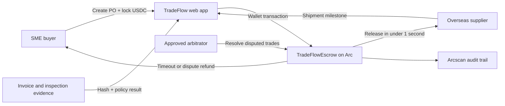

# TradeFlow architecture

## Stack

- Arc Testnet (`5042002`) as the settlement network.
- Native USDC for gas and escrow value.
- Solidity escrow with buyer, seller and independent-arbitrator roles.
- Responsive Next.js/Vinext web experience with MetaMask-compatible wallet support.
- Demo mode for zero-funds judging; live mode for contract-backed testnet transactions.

## Security model

- Checks-effects-interactions and a reentrancy lock protect value transfers.
- A unique `bytes32` purchase-order reference prevents duplicate escrows.
- Funds can only settle after delivery confirmation, through arbitration, or return after a pre-shipment timeout.
- The contract stores only settlement state; private commercial documents remain offchain and can be represented by hashes.
